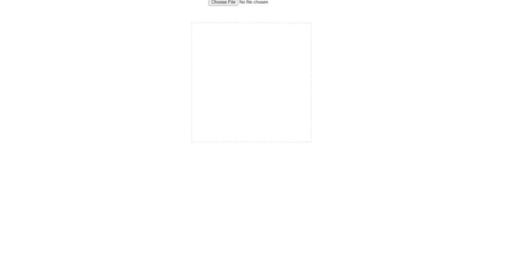

# ReactJS - Image Crop Upload

ReactJS based reusable component for Image upload with cropping.

## Table of contents

- [Browser Support](#browser-support)
- [Demo](#demo)
- [Getting started](#getting-started)
- [Available Props](#available-props)
- [Want to Contribute?](#want-to-contribute)
- [Collection of Components](#collection-of-components)
- [Changelog](#changelog)
- [Credits](#credits)
- [License](#license)
- [Keywords](#Keywords)

## Browser Support


|  |  |  |  |  |
| ---------------------------------------------------------------------------------------- | ------------------------------------------------------------------------------------------- | ---------------------------------------------------------------------------------------- | ---------------------------------------------------------------------------------- | ---------------------------------------------------------------------------------------------------------------------------- |
| 83.0 ✔                                                                                   | 77.0 ✔                                                                                      | 13.1.1 ✔                                                                                 | 83.0 ✔                                                                             | 11.9 ✔                                                                                                                       |

## Demo

[](https://github.com/weblineindia/ReactJS-Image-Crop-Upload/image.gif)

## Getting started

Install the npm package:

``` bash
npm install react-weblineindia-image-crop-upload
#OR
yarn add react-weblineindia-image-crop-upload
```

```js
import React from 'react'
import AvatarEditor from 'react-weblineindia-image-crop-upload'
 
class MyEditor extends React.Component {
  render() {
    return (
      <AvatarEditor
        image="http://example.com/initialimage.jpg"
        width={250}
        height={250}
        border={50}
        color={[255, 255, 255, 0.6]}
        scale={1.2}
        rotate={0}
      />
    )
  }
}
 
export default MyEditor
```

## Available Props

| Prop                   | Type             | Description                                                                                                                                                                                                                                                          |
| ---------------------- | ---------------- | -------------------------------------------------------------------------------------------------------------------------------------------------------------------------------------------------------------------------------------------------------------------- |
| image                  | String           | The URL of the image to use, or a File (e.g. from a file input).                                                                                                                                                                                                     |
| width                  | Number           | The total width of the editor.                                                                                                                                                                                                                                       |
| height                 | Number           | The total height of the editor.                                                                                                                                                                                                                                      |
| border                 | Number           | The cropping border. Image will be visible through the border, but cut off in the resulting image. Treated as horizontal and vertical borders when passed an array.                                                                                                  |
| borderRadius           | Number           | The cropping area border radius.                                                                                                                                                                                                                                     |
| color                  | Number[]         | The color of the cropping border, in the form: [red (0-255), green (0-255), blue (0-255), alpha (0.0-1.0)].                                                                                                                                                          |
| style                  | Object           | Styles for the canvas element.                                                                                                                                                                                                                                       |
| scale                  | Number           | The scale of the image. You can use this to add your own resizing slider.                                                                                                                                                                                            |
| position               | Object           | The x and y co-ordinates (in the range 0 to 1) of the center of the cropping area of the image. Note that if you set this prop, you will need to keep it up to date via onPositionChange in order for panning to continue working.                                   |
| rotate                 | Number           | The rotation degree of the image. You can use this to rotate image (e.g 90, 270 degrees).                                                                                                                                                                            |
| crossOrigin            | String           | The value to use for the crossOrigin property of the image, if loaded from a non-data URL. Valid values are `"anonymous"` and `"use-credentials"`. See [this page](https://developer.mozilla.org/en-US/docs/Web/HTML/CORS_settings_attributes) for more information. |
| className              | String|String[] | className property passed to the canvas element                                                                                                                                                                                                                      |
| onLoadFailure(event)   | function         | Invoked when an image (whether passed by props or dropped) load fails.                                                                                                                                                                                               |
| onLoadSuccess(imgInfo) | function         | Invoked when an image (whether passed by props or dropped) load succeeds.                                                                                                                                                                                            |
| onImageReady(event)    | function         | Invoked when the image is painted on the canvas the first time.                                                                                                                                                                                                      |
| onMouseUp()            | function         | Invoked when the user releases their mouse button after interacting with the editor.                                                                                                                                                                                 |
| onMouseMove(event)     | function         | Invoked when the user hold and moving the image.                                                                                                                                                                                                                     |
| onImageChange()        | function         | Invoked when the user changed the image. Not invoked on the first render, and invoked multiple times during drag, etc.                                                                                                                                               |
| onPositionChange()     | function         | Invoked when the user pans the editor to change the selected area of the image. Passed a position object in the form `{ x: 0.5, y: 0.5 }` where x and y are the relative x and y coordinates of the center of the selected area.                                     |
| disableBoundaryChecks  | Boolean          | Set to `true` to allow the image to be moved outside the cropping boundary.                                                                                                                                                                                             |
| disableHiDPIScaling    | Boolean          | Set to `true` to disable devicePixelRatio based canvas scaling.  Can improve perfermance of very large canvases on mobile devices.                                                                                                                                      |


## Want to Contribute?

- Created something awesome, made this code better, added some functionality, or whatever (this is the hardest part).
- [Fork it](http://help.github.com/forking/).
- Create new branch to contribute your changes.
- Commit all your changes to your branch.
- Submit a [pull request](http://help.github.com/pull-requests/).

---

## Collection of Components

We have built many other components and free resources for software development in various programming languages. Kindly click here to view our [Free Resources for Software Development](https://www.weblineindia.com/communities.html)

------

## Changelog

Detailed changes for each release are documented in [CHANGELOG.md](./CHANGELOG.md).

## Credits

react-weblineindia-image-crop-upload is inspired by the [react-avatar-editor](https://www.npmjs.com/package/react-avatar-editor).

## License

[MIT](LICENSE)

[mit]: https://github.com/weblineindia/ReactJS-Image-Crop-Upload/blob/master/LICENSE

## Keywords

react-weblineindia-image-crop-upload,reactjs-weblineindia-image-crop-upload, reactjs-image-upload, react-image-upload, image-crop, reactjs-image-crop-upload, react-image-crop-upload, image-uploader
